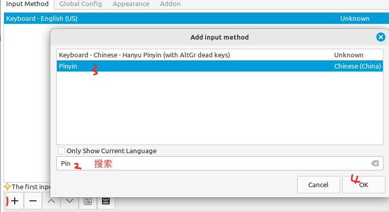
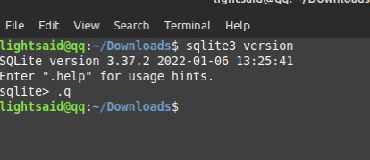
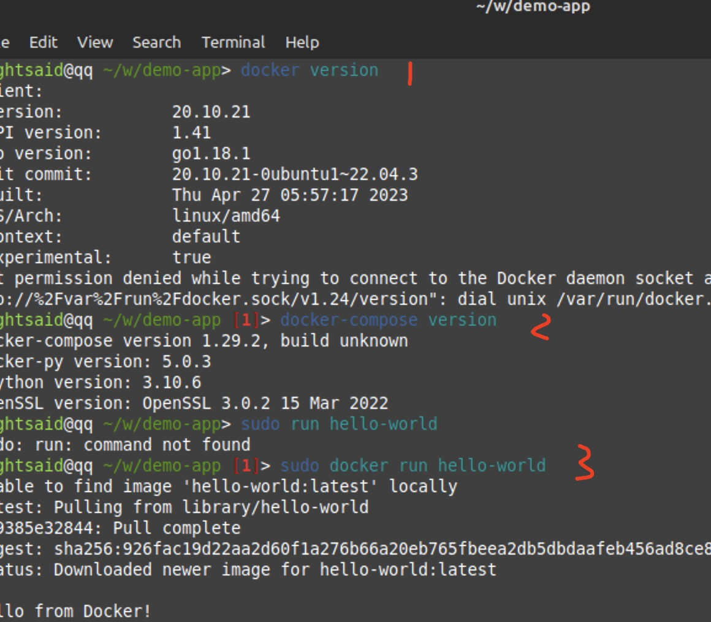

# Linux Mint 21.2 系统安装和搭建 Golang & Node 开发环境

创建于：2023-07-27

在众多 Linux 发行版中，Linux Mint 是非常易于上手使用的，它是基于 Ubuntu 和 Debian 的开源操作系统。
它提供了一个友好的界面、丰富的软件库和可靠的性能，使用户能够尽情享受 Linux 操作系统带来的优势。
这一次使用刚发布不久的 Linux Mint 21.2 版本搭建一个 Golang & Node 开发环境。

**我的本地环境**
- MacBook Pro
- macOS Ventura version 13.4.1
- Parallels Desktop 18 

**下载 Linux Mint 21.2**

来到[官网下载页](https://linuxmint.com/download.php)，官方提供了3种桌面风格。如下：


**三种桌面风格版本介绍**


我这里选择 Cinnamon Edition 版本，点击 `Download` 后选择国内的镜像下载即可。

### 使用 Parallels Desktop 安装 Linux Mint

**一大波安装过程图片来袭**


**`进入安装设置界面，我个人习惯默认设置，除了时间选择中国上海，其他基本上默认设置，安装完成后再进行设置；这里跳过默认设置过程，其他如下图：`**

**勾选这个视频解码器，浏览器就可以直接播放视频了**


**至此，设置设置完毕，非常简单 Nice，接下来就是等待系统自动配置安装，可以做一下其他事情，安装完成后重启即可**


### 安装 Parallels Tools

上面操作已经完成 Linux Mint 系统的安装，现在第一件事我希望同步主机复制功能，宿主机和虚拟机共享复制功能和共享文件，因此需要安装 Parallels Tools 工具。

**Let's Go**

点击右上角的三角形感叹号，进行安装


点击继续


进入文件夹打开终端执行安装命令进行安装：
```bash
sudo ./install
```


遇到下面类似的选择，一律 Next 回车即可。


安装完成后，重启。

重启后弹出 Parallels Tools 安装工具，因此安装完了，不再需要此功能。


尝试一下从宿主机复制文本到虚拟机试试，一切OK。


### 换源

在 Linux Mint 中只需要点点点，即可换源，而不需要去编辑`/etc/apt/sources.list`配置。

如下：


**如果上面没有设置对的哇，可以通过 edit 菜单找到**


至此，源换成功了，执行一下更新命令：
```bash
sudo apt update
sudo apt upgrade
```

重启一下，进行下一步的配置。

### 拼音（中文）输入法安装

首先找到`Input Method` 输入法配置，安装中文语言包，Input Method framework 切换成 Fcitx，然后重启进行下一步配置。

**`!!! 如果重启后，发现菜单乱码了，请点击右下角菜单的警告icon的菜单，安装一下语言包即可，这步忘记截图了，分不清的那个的话，右下角每个都点一下看看即可 !!!`**


重启完成后，找到 Fcitx Configuration




再重启一次，检验输入法，这提示语。。。。有点儿不正经。。。


那拼音输入法到此OK。


### 安装 VS Code

直接去到 VS Code 官网，点击 .deb 包下载即可，但是这个下载很慢的，因此需要替换下载链接，复制下载链接，替换部分内容重新下载就很快了。

将下载地址中的 az764295.vo.msecnd.net 更换为 vscode.cdn.azure.cn 使用国内的镜像服务器加速。

如将：
https://az764295.vo.msecnd.net/stable/74f6148eb9ea00507ec113ec51c489d6ffb4b771/code_1.80.1-1689183569_amd64.deb

替换成：
https://vscode.cdn.azure.cn/stable/74f6148eb9ea00507ec113ec51c489d6ffb4b771/code_1.80.1-1689183569_amd64.deb

重新张贴到浏览器下载即可。


对于 .dep 包使用 dpkg 命令安装，如果不熟悉的话，可以使用 man dpkg 查看手册。
这里简单介绍三个dpkg相关命令,如果没有权限加sudo。
``` bash
dpkg -i xxx.deb # 安装具体deb包
dpkg -r xxx     # 卸载软件包
dpkg -P xxx     # 彻底删除软件包，包括其配置文件
```

安装 vscode

```bash
sudo dpkg -i code_1.80.1-1689183569_amd64.deb  # 安装
code  # 打开 vscode
```

测试中文输入。


### 安装 SQLite

个人非常喜欢SQLite这个数据库，非常简便，零配置，而且非常快和稳定，支持SQL语句。非常适合用来做移动端存储或者练习列子。我还准备使用它作为我的博客数据库。

在这里将使用 apt 工具来安装，查看 apt 手册或者帮助文档，还是老方法：man apt / apt --help.

安装 sqlite3
```bash
sudo apt install sqlite3
sqlite3 version
```



### 安装 Golang

安装 Golang 相信大部分都是下载压缩包解压配置的。

对于懒人来说，更希望通过命令安装，在这里通过添加 Golang PPA 软件源来安装。

step by step install


对就这么简单，执行三个命令即可
``` bash
sudo add-apt-repository ppa:longsleep/golang-backports # 输入后按回车
sudo apt update                                        # 更新软件源
sudo apt install golang-go                             # 安装
``` 

验证成功与否
```bash
go version   # 查看版本
go env       # 查看环境变量
whereis go   # 查看go安装位置
go env -w GOPROXY=https://goproxy.cn,direct  # 设置代理
```
一切顺利后，设置代理。

**体验并设置 VSCode + Go 开发配置**
``` bash
cd ~/ && mkdir go && cd go  # 创建 GOPATH 目录，存在则不用创建

mkdir src bin pkg      

cd src && mkdir -p github.com/lightsaid

cd github.com/lightsaid

mkdir zinx && cd zinx       # 创建zinx项目，并cd到项目里

go mod init github.com/lightsaid/zinx  # 初始化模块

ls # 检查是否有 go.mod 文件

code . # 使用 vs code 打开项目
```
使用 vs code 打开项目后，安装一些 go 开发插件。


安装一下go工具，按 `Shift + Ctrl + P` 输入搜索，选择全部点击ok等待安装即可。


安装插件完成后，简单写写代码感受一下工具带来的便利，创建 main.go
``` go
package main
import "fmt"
func main() {
	fmt.Println("Hello World!")
}
```

运行和编译试试：

```bash
go run main.go
go build -o=app main.go
./app
```
顺顺利利，nice。

### 安装 Fish Shell


在这里发现终端的名字越来越长了，想简化一下和使用命令有更好的提示；这里推荐使用fish shell 工具，当然喜欢zsh的安装它也行。

官网安装方式，搜索 fish shell 查找一下命令就出来了，安装的时候最好去官网看看，以免命令发生变化，及时做出更改。
```bash
sudo apt-add-repository ppa:fish-shell/release-3
sudo apt update
sudo apt install fish
```

**如何使用？两个命令，进入和退出**
``` bash
fish
exit
```


### 安装 git 和 初始化配置

``` bash
sudo apt install git -y 
git version
git config --global user.name lightsaid           # 设置用户名
git config --global user.email lightsaid@163.com  # 设置用户邮箱
ssh-keygen  # 生成密钥，按三次回车，即可免密
ls ~/.ssh/  # 查看公钥和私钥文件
cat ~/.ssh/id_rsa.pub # 查看公钥，并拷贝到github，则可以push/pull代码
```

### 搭建前端开发环境

**安装 nvm，通过nvm管理Node版本**

去[github](https://github.com/nvm-sh/nvm)查找安装方式,非常简单就一个命令

``` bash
curl -o- https://raw.githubusercontent.com/nvm-sh/nvm/v0.39.4/install.sh | bash
```

这是一个看运气的命令，佛祖开光都没用，然并卵，我连上了raw.githubusercontent.com。

如果链接不上 raw.githubusercontent.com ，可以到 ipaddress.com 搜索查找对应的ip，然后修改
/etc/hosts文件，再进行安装。

安装完成后，关闭终端重新打开，输入 nvm 即可验证是否成功。

默认的bash是可以的，但是 fish shell 下，找不到 nvm 命令，因此需要设置一下。按照github给出的文件去配置。

首先的安装依赖 [bass](https://github.com/edc/bass) 项目。安装如下：


去到 `~/.config/fish/functions` 里面，按照下面配置一个个创建并设置。

这里不使用 vim 编辑文件，而是安装 `sudo apt install gedit`，使用它来编写配置文件。

如第一个配置 sudo gedit nvm.fish,其他如是这样。

``` bash
# ~/.config/fish/functions/nvm.fish
function nvm
  bass source ~/.nvm/nvm.sh --no-use ';' nvm $argv
end

# ~/.config/fish/functions/nvm_find_nvmrc.fish
function nvm_find_nvmrc
  bass source ~/.nvm/nvm.sh --no-use ';' nvm_find_nvmrc
end

# ~/.config/fish/functions/load_nvm.fish
function load_nvm --on-variable="PWD"
  set -l default_node_version (nvm version default)
  set -l node_version (nvm version)
  set -l nvmrc_path (nvm_find_nvmrc)
  if test -n "$nvmrc_path"
    set -l nvmrc_node_version (nvm version (cat $nvmrc_path))
    if test "$nvmrc_node_version" = "N/A"
      nvm install (cat $nvmrc_path)
    else if test "$nvmrc_node_version" != "$node_version"
      nvm use $nvmrc_node_version
    end
  else if test "$node_version" != "$default_node_version"
    echo "Reverting to default Node version"
    nvm use default
  end
end

# ~/.config/fish/config.fish
if status is-interactive
    # Commands to run in interactive sessions can go here
    load_nvm > /dev/stderr
end
```

将上面内用配置好后，如图


重新打开终端：
```bash
fish
nvm
```


接来使用nvm 安装node：
```bash
nvm install --lts    # 安装最新的lts（稳定）版本
node -v              # 验证版本
nvm ls-remote        # 查看可以安装的版本
nvm install 16.20.1  # 安装制定版本，这也是一个lts版本
nvm list             # 查看已安装版本
nvm use v16.20.1     # 使用指定版本
nvm alias default 16.20.1 # 设置默认版本为v16.20.1
npm install -g cnpm --registry=https://registry.npmmirror.com # 安装淘宝镜像cnpm
cnpm -v             # 验证是否成功 
```

使用一下node环境是否ok；
``` bash
cd ~ && mkdir web-application && cd web-application # 创建文件
npm create vite  # 创建项目
...
npm run dev
```
创建项目：


### 安装 Docker

不用参照官网，官网太麻烦了，而且特别容易...失败。

下面来简单直接一点安装，不用花里胡哨

```bash
sudo apt install docker.io docker-compose
docker version
docker-compose version
sudo docker run hello-world
# 设置权限
sudo chmod 666 /var/run/docker.sock
```



docker 命令权限设置图


**使用docker-compose测试安装mysql**

在刚才的demo-app 目录下，创建 docker-compose.yml
```yml
version: "3.8"

services:
  mysqldb:
    image: "mysql:5.7.22"
    ports:
      # mysql端口映射，属主机使用这个mysql服务，用DB_PORT端口；而容器之间使用则用 3306
      - "3306:3306"  
    restart: always  # 总是启动，当docker启动时，就会启动这个服务
    environment:
      MYSQL_ROOT_PASSWORD: 123456
      MYSQL_DATABASE: db_test
      MYSQL_PASSWORD: 123456
```
执行 docker-compose 构建命令
```bash
# 构建服务
docker-compose up -d

# 删除服务
docker-compose down
```

**验证docker、docker-compose 使用**


一切OK，没问题。

### 安装 dbeaver 作为数据库管理系统

去到[dbeaver](https://dbeaver.io/download/)里面有安装命令

这个下载是真的慢， 因此不建议。
``` bash
sudo add-apt-repository ppa:serge-rider/dbeaver-ce
sudo apt update
sudo apt-get install dbeaver-ce
```

直接下载 deb 安装包安装更快。

``` bash
sudo dpkg -i dbeaver-ce_23.1.3_amd64.deb
```


至此，搞掂基础环境。

### 备份虚拟机
拷贝一份，就可以愉快地玩耍了，即使折腾坏了，也没关系～


当然使用 Timeshift 也是需要的，限于篇幅，到此为止。


### 2023-7-28 问题补充，解决 VS Code 编码过程中闪屏问题

在Linux Mint系统中，使用 VsCode 在编码过程时不时回闪屏，带有彩色的背景，很影响使用；产生这个一问题的原因是因为VsCode使用GPU加速渲染，解决办法也很简单，简单4步搞掂。

1. 按 `Ctrl + Shift + P` 
1. 搜索找到 `Preferences: Configure Runtime Arguments` 按回车
1. 解开注释使用这个配置 `"disable-hardware-acceleration": true`
1. 重启，问题解决

### 2023-7-30 问题补充， Linux Mint 无法进入桌面

今天一觉睡醒，重新打开 Linux Mint 编码时，更改的文件无法保存，一开始以为是VsCode权限问题，尝试重启了VsCode，问题依旧存在。那就干脆重启系统吧，突然有种不好的预感，我的代码还没上传到github，万一系统真的挂了，那这两天的编码不久白费了。

果真如此，logo闪了一下，直接崩了，重启无法进入桌面，心中拔凉拔凉～～

错误信息如下,着急解决问题，没有截图：

``` bash
busyBox v1.30.1 （Ubuntu 1:1.30.1-7ubuntus3）built-in shell （ash）
Enter 'help' for a list of built-in commands.
(initeramfs)
```
**`原因`**

发生这个问题的原因可能在引导过程中，可能文件系统发生了损坏，导致无法加载根文件系统；究竟是什么原因导致文件
损坏不可得知了。

**`解决`**

解决这个问题的需要使用`fsck`命令检查并修复根文件，如：`fsck /dev/sda1 -y`；

解决步骤：

1. 首先查找根文件路径, 在终端输入 `exit` 回车，看到 如 `... root filesytem on /dev/sda3 ...`
那么根文件路径就是 `/dev/sda3`

1. 执行 `fsck /dev/sda3 -y` 检查并修复

1. 重启 `reboot`， 可能无反应

1. 上面重启如果无效就输入 `exit` 按回车即可重启，Linux Mint 又可以正常工作了。

[解决方案参考-1](https://forums.linuxmint.com/viewtopic.php?t=395943)

[解决方案参考-2](https://ostechnix.com/how-to-fix-busybox-initramfs-error-on-ubuntu/)

**`总结`**

使用 Linux 遇到问题不要慌，总有解决办法的。保持良好的提交代码习惯，尽量减少损失。
